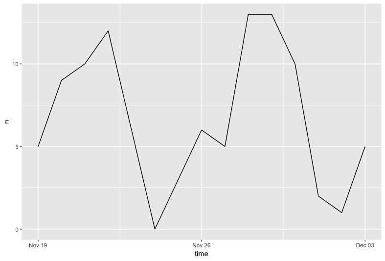

```{r setup, include=FALSE}
knitr::opts_chunk$set(echo = TRUE)
```
```{r include=FALSE,echo=FALSE}
library(knitr)
#library(magick)
knitr::opts_chunk$set(fig.width=7,echo=TRUE, fig.height=7, warning=FALSE, message=FALSE,prompt=T,tidy=T,include=TRUE,cache=TRUE,fig.align='center',fig.asp=0.50,opts.label ="squarefigure",cache = TRUE,fig.path = "README_figs/README-")


```


```{r include=FALSE,echo=FALSE}
library(knitr)
#library(magick)
# Chunk options
knitr::opts_chunk$set(fig.width=7,echo=TRUE, fig.height=7, warning=FALSE, message=FALSE,prompt=T,tidy=T,include=TRUE,cache=TRUE,fig.align='center',fig.asp=0.50,opts.label ="squarefigure",cache = TRUE)
library (rtweet)
library(ggplot2)
library(tidytext)
library (dplyr)
library (readr)
library(stringr)
library(tidyr)
library(scales)
library(wordcloud)
library(reshape2)
```

Social media analytics (SMA) is a powerful tool that offer wide opportunities for academics and industry professionals. SMA relates to a number of tools to collect data from digital media platforms, process it into structured insights and assist in more information-driven decision making. The tutorial introduces SMA with R.


### Topics covered during the tutorial include:


* Benefits and challenges working with social media data (textual/non-textual information, large data volume, API access)

* Structure of the social media data (e.g. user-related data, posting related data, hashtags)

* Connecting to a social media platform (e.g. authentication) and downloading data 

  [Setting up API access for Twitter] (# setup-API)
  
  [Connecting to Twitter from R](#connect)
  
  [Downloading tweets with `twitterR`] (# downloading-tweets)


* Data analysis of the profile information (e.g. followers, likes, dislikes, favorites - platform dependent)
  [Analyse tweets] (# analyse-tweets)

* Data analysis of textual information and non-textual (e.g. user posts, comments, dynamics, sentiment analysis, word clouds, etc.)
  [Analyse text tweets] (# analyse-text)

* Visualisation of the social media data

______

### Resource:
* [Packages to be used - please install] 

```{r eval=FALSE}
install.packages ("rtweet")

install.packages("ggplot2")
install.packages("tidytext")
install.packages("dplyr")
install.packages("readr")
install.packages("stringr")
install.packages("tidyr")
install.packages("scales")
install.packages("wordcloud")
install.packages("reshape2")
```

* Reference material

[Setting up the Twitter R package for text analytics](https://www.r-bloggers.com/setting-up-the-twitter-r-package-for-text-analytics/)

[Setting API for rtweet](https://rtweet.info/articles/auth.html)

________


* R and RStudio installation

R is a free software environment for data analysis and visualisation. It runs on a variety of platforms, including Windows and MacOS. You can download R for your computer 

[for Windows](https://cran.r-project.org/bin/windows/base/)

[for MacOS](https://cran.r-project.org/bin/windows/base/)

Once R is installed, please install RStudio [here](https://www.rstudio.com/products/rstudio/download/) - use RStudio Desktop Open Source License

The installation is very straightforward, but you can also have a look at these tutorials

[install RStudio for Windows](https://www.youtube.com/watch?v=Ohnk9hcxf9M)

[install RStudio for Mac](https://www.youtube.com/watch?v=uxuuWXU-7UQ)

___

### Connecting to Twitter from R {#connect}

Before you start working with Twitter in R, you need to setup your access in the Twitter itself. Please see [Setting up API in Twitter](twitterAPI.Rmd)

Note down:

* Your App Name

* Your Consumer Key (API Key)

* Consumer Secret (API Secret)

_____

There are two main R packaages to work with Twitter:

* [`rtweet`](https://cran.r-project.org/web/packages/rtweet/index.html) 
* [`twitteR`](https://cran.r-project.org/web/packages/twitteR/README.html)

In this tutorial we will be using `rtweet`

To use this package you need to install it in R first. You do it by typing the following line 

```{r eval=FALSE}
install.packages("rtweet")
```

We will also need several more packages to work with data:

```{r eval=FALSE}
install.packages("ggplot2")
install.packages("tidytext")
install.packages("dplyr")
install.packages("readr")
install.packages("stringr")
install.packages("tidyr")
install.packages("scales")
install.packages("wordcloud")
install.packages("reshape2")
```

and then load these packages
```{r eval=FALSE}
library (rtweet)
library(ggplot2)
library(tidytext)
library (dplyr)
library (readr)
library(stringr)
library(tidyr)
library(scales)
library(wordcloud)
library(reshape2)
```
Now you are all ready to go!

To connect to Twitter you need to set up your access variables:

```{r eval=FALSE}
# whatever name you assigned to your created app
appname <- "MariaP"

## api key (example below is not a real key)
key <- "XXXXXXXXXX"

## api secret (example below is not a real key)
secret <- "YYYYYYYYYY"
```

Now let's create a token and connect!

```{r eval=FALSE}
twitter_token <- create_token(
  app = appname,
  consumer_key = key,
  consumer_secret = secret)
```

`create_token` function sends a request to generate your access token. The technical part of this is explained [here](https://developer.twitter.com/en/docs/basics/authentication/overview/oauth)

_________
We are all ready to go! Let's search out tweets.

`search_tweet` function is fantastic. It allow you search hashtags and user timelines. It takes the folowing arguments

```{r eval=FALSE}
SydneyTweets <- search_tweets(q = "Sydney", n = 1000, lang = "en", include_rts = FALSE)  
MelbourneTweets <- search_tweets(q = "Melbourne", n = 1000, lang = "en", include_rts = FALSE)

```

* `q`: query to be searched
* `n`: number of tweets to return. The maximum is 18,000. But you will need to do this in "batches", so need to use `retryonratelimit` argument
* `include_rts`: if set to FALSE, retweets are excluded from the results

Let's see how frequenty tweets appear
```{r eval=FALSE}
ts_plot(SydneyTweets, by="days")
```

```{r echo=FALSE,fig.cap="Frequency of tweets with #sydney"}
knitr::include_graphics("tutorial images/sydney1.png")

```

or if we want to be more fancy!

```{r eval=FALSE}
  ts_plot(SydneyTweets, "mins") +
    labs (
      x="Date and time",
      y="Frequency of tweets",
      title="Time series of #Sydney tweets"
    ) +
    theme_dark()
```

```{r echo=FALSE,fig.cap="Adding some elements to the graph"}
knitr::include_graphics("tutorial images/sydneydark.png")
```

We can get tweets from a particular Twitter account using `get_timeline`

```{r eval=FALSE}
  MelbourneCityTweets <- get_timeline("cityofmelbourne")
  SydneyCityTweets <- get_timeline("cityofsydney")

```

Let's visualise their frequencies

```{r eval=FALSE}
  ts_plot(MelbourneCityTweets, "days")
  ts_plot(MelbourneCityTweets, "hours")
  ts_plot(SydneyCityTweets, "days")
  ts_plot(SydneyCityTweets, "hours")
```

```{r echo=FALSE,fig.cap="Frequencies of @CityOfMelbourne tweet, days"}


```

```{r echo=FALSE,fig.cap="Frequencies of @CityOfMelbourne tweet, hours"}
knitr::include_graphics("tutorial images/melbournehours.png")
```

Let's merge two datasets for hashtag tweets and add a label 'city' 

```{r eval=FALSE}
  tweets <- bind_rows(MelbourneTweets %>% 
                        mutate(city = "Melbourne"),
                      SydneyTweets %>% 
                        mutate(city = "Sydney")) 
```

Let's count how many times each user used the hashtag for the city

```{r eval=TRUE, echo=FALSE, warning=FALSE, message=FALSE}
  tweets<-read_csv("tutorial data/tweets.csv") 

```

```{r eval=TRUE, warning=FALSE, message=FALSE}

  tweets<-tweets %>% 
    add_count(user_id)
kable(tweets[5:10, 3:6])

```

and let's draw it
```{r eval=TRUE, warning=FALSE, message=FALSE}

  ggplot(tweets, aes(x = user_id, y=n, color= city)) + geom_point()
```

_______

You can also search Twitter user data using `lookup_users`:

```{r eval=TRUE, echo=FALSE, warning=FALSE, message=FALSE}

  cityTweets<-read_csv("tutorial data/citytweets.csv") 
```

```{r eval=FALSE}
users <- c("cityofsydney", "cityofmelbourne")
cityTweets <- lookup_users(users)
```

```{r eval=TRUE,  warning=FALSE, message=FALSE}
kable(cityTweets[5:10, 3:6])

```

Lookup friends
```{r eval=FALSE}

  city_fds <- get_friends(users)
```
  
Lookup followers
```{r eval=FALSE}

  city_flw <- get_followers("cityofsydney", n = 75000)
``` 
  
 Lookup data on followers' accounts
 ```{r eval=FALSE}

  city_flw_data <- lookup_users(city_flw$user_id)
``` 

Let's have a look at Word frequencies in tweets, but first we need to clean them to remove unwanted characters that Twitter specific, we also remove stop words, punctuation etc.
  
```{r eval=TRUE,  warning=FALSE, message=FALSE}
remove_reg <- "&amp;|&lt;|&gt;"
  cityTweets_tidy <- cityTweets %>% 
    filter(!str_detect(text, "^RT")) %>%
    mutate(text = str_remove_all(text, remove_reg)) %>%
    unnest_tokens(word, text, token = "tweets") %>%
    filter(!word %in% stop_words$word,
           !word %in% str_remove_all(stop_words$word, "'"),
           str_detect(word, "[a-z]"))
```

Calculate frequencies of words for these two accounts

```{r eval=TRUE,  warning=FALSE, message=FALSE}

  frequency <- cityTweets_tidy %>% 
    group_by(city) %>% 
    count(word, sort = TRUE) %>% 
    left_join(cityTweets_tidy %>% 
                group_by(city) %>% 
                summarise(total = n())) %>%
    mutate(freq = n/total) 
  frequency
  
```

Let's make the table more readable

```{r eval=TRUE,  warning=FALSE, message=FALSE}

  frequency <- frequency %>% 
    select(city, word, freq) %>% 
    spread(city, freq) %>%
    arrange(Melbourne, Sydney)
  
  frequency
```
 
Let's visualise frequencies

Words near the line are used with about equal frequencies by Melbourne and Sydney, while words far away from the line are used much more by one account compared to the other.
 
```{r eval=TRUE,  warning=FALSE, message=FALSE}
 
  ggplot(frequency, aes(Melbourne, Sydney)) +
    geom_jitter(alpha = 0.1, size = 2.5, width = 0.25, height = 0.25) +
    geom_text(aes(label = word), check_overlap = TRUE, vjust = 1.5) +
    scale_x_log10(labels = percent_format()) +
    scale_y_log10(labels = percent_format()) +
    geom_abline(color = "red")
```

Now let's do wordclouds for a merged dataset

```{r eval=TRUE,  warning=FALSE, message=FALSE}

  cityTweets_tidy %>% 
    count(word, sort = TRUE)  %>%
    with(wordcloud(word, n, max.words = 100))
``` 
  
and for @cityofSydney
```{r eval=TRUE,  warning=FALSE, message=FALSE}

  cityTweets_tidy %>% 
    filter(city=="Sydney")%>% 
    count(word, sort = TRUE)  %>%
    with(wordcloud(word, n, max.words = 100))
``` 

  
Let's get the wordcloud for positive and negative words
```{r eval=TRUE,  warning=FALSE, message=FALSE}

  cityTweets_tidy %>%
    inner_join(get_sentiments("bing")) %>%
    count(word, sentiment, sort = TRUE) %>%
    acast(word ~ sentiment, value.var = "n", fill = 0) %>%
    comparison.cloud(colors = c("gray20", "gray80"),
                     max.words = 100)
```  
  


 